# CML 2.5 Hands-on Lab


Cisco Modeling Labs (CML) is the go-to tool for network simulation of Cisco reference platforms and beyond. In this workshop, we’re going to cover the product from A to Z with a special focus on automation.  In addition, we’re going to show how to extend the platform by adding  Kali Linux.

[TOC]

## Agenda

- Installation and licensing of the product (demo)
- Cockpit – system management, enabling SSH to access the Linux CLI
- Simulation Life cycle  (simulation state, creating a topology, working with the UI, hands-on)
- Installation of 3rd Party Image (node and image definition creation, image upload)
- Exploring and using the API via Swagger
- Use of the Python Client Library (PCL)
- virl-utils: taking the PCL to the next level
- Breakout tool: what is it and how to use it
- Accessing consoles using the terminal server
- Additional references and closing

## Prerequisites

The workshop will be running on Cisco dCloud. The installation section will be "demo-only", you can later refer to it in the recording.

A link will be provided during the WebEx session which will assign each attendee a dCloud lab (limited seats available). When accessing this link, a page like this will be shown:

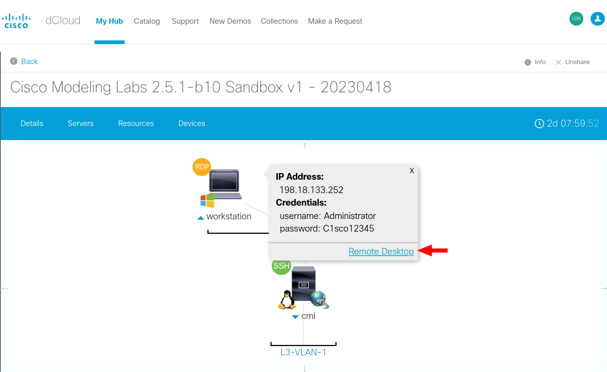

Click the "Remote Desktop" link for the workstation. A RDP session will open in your browser. It's recommended to take this RDP session to full screen and / or put it on a second display.

Refer to the appendix in case you want to repeat this workshop on your own hardware at home or at work.

## Sections

### Installation and licensing (demo)

Installation is done either as a virtual machine (preferred) or on a bare metal server. The VM requires an OVA to be deployed, for the bare metal install an ISO image is used to boot the server and install from there.

Once the OVA is deployed, the text based installer is started. It will ask a few questions about usernames, passwords, interfaces etc.

In addition, it is also determined whether CML should be deployed as an "all in one" or as a "cluster". Cluster deployments require two NICs per cluster member (controller and computes).

Part of the installation is also the copying of the so-called "reference platform ISO" with disk images to the hard drive of the controller. This is the part that takes the most time. Overall, the entire installation takes roughly 10-15 minutes.

Next, a license must be applied. This is done via the CML Web UI. The address to connect to is displayed on the screen of the machine when the installer has finished.

The licensing requires connectivity to the Internet to validate the license token. The token is generated via the software licensing center at https://software.cisco.com. It's a single string that can be copied and pasted into the Web UI. For enterprise licenses, additional node licenses can be configured, the standard license includes 20 Cisco node licenses.

### Cockpit

Certain system maintenance tasks are done via Cockpit, the built-in system admin tool. This includes:

- adding and configuring additional network interface cards (NICs)
- a command line terminal 
- service management

In addition, a custom CML plugin allows for additional, CML specific tasks.

- CML maintenance tasks
- Upgrading CML software
- Restarting CML services
- etc.

After logging in, the CML specific section is shown:


A common task done here is to re-enable the system SSH service which will then listen on port TCP/1122. It is disabled after installation as a security best-practice.

Go to "Services" and search for SSH:


Then click that table row, on the new page enable the service by clicking the "on" switch:


You should now be able to log into the CML host using SSH and get access to the command line:


**TODO:** provide a better screen shot

This concludes the Cockpit section.

### Simulation life-cycle

This section simply teaches the user to navigate the UI. The various sections to explore are:

- dashboard. where all labs are displayed either as tiles or in a list
- we can import labs shared with us from here by pressing the "Import" button
- we can add new labs by pressing the "Add" button
- Actions on lab tiles include start, stop, wipe and delete

When adding a lab or opening an existing lab, the lab editor is shown. This is the "heart" of the Web UI. Things to do here are

- editing a topology by adding nodes and links. Nodes can be dragged from the palette on the right and then drop onto the canvas. Links can be added by right-clicking a node and selecting "Add link"
- configurations can be edited on "wiped" nodes
- nodes can be interacted with via the console or VNC tab (where available)
- on links, traffic conditions like delay or loss can be dialed in or a packet capture can be started
- annotations (ellipses, rectangles, lines, arrows, text) can be added and edited
- various display options can be toggled

Options / tabs on the bottom panel change depending on what kind of topology element is selected.

This concludes the Simulation life-cycle section.

### Installation of third party image

We're going to install a Kali cloud image as a custom image into CML. The Kali image is ~170 MB in size and is provided as a cloud-image which can be installed in CML "as-is". The image is available [here](https://www.kali.org/get-kali/#kali-cloud).

#### Kali Image download and conversion

Execute these commands on the CML controller's command line by either using the Cockpit terminal or by using PuTTY to log into CML. Remember that the user name is "sysadmin" and the port to connect to is 1122!

These commands don't require privileges, they can be run by the sysadmin user. We use cURL to download the image from the web.

```plain
$ curl -LO https://kali.download/cloud-images/kali-2023.2/kali-linux-2023.2-cloud-genericcloud-amd64.tar.xz
  % Total    % Received % Xferd  Average Speed   Time    Time     Time  Current
                                 Dload  Upload   Total   Spent    Left  Speed
100  173M  100  173M    0     0  4634k      0  0:00:38  0:00:38 --:--:-- 4984k
$ tar xvf kali-linux-2023.2-cloud-genericcloud-amd64.tar.xz 
disk.raw
$ ls -lh
total 1.5G
-rw-r--r--. 1 rschmied rschmied  12G May 23 05:13 disk.raw
-rw-rw-r--. 1 rschmied rschmied 174M Jul  5 19:17 kali-linux-2023.2-cloud-genericcloud-amd64.tar.xz
$
```

Next, we convert the "raw" disk to a QCOW2 disk. The flags ensure progress is shown and that the result is compressed. We then remove the intermediate files to free up space. Finally, we print some information about the created disk image.

```
$ qemu-img convert disk.raw -c -p -O qcow2 kali.qcow2
    (100.00/100%)
$ rm kali-*.tar.xz disk.raw
$ qemu-img info kali.qcow2 
image: kali.qcow2
file format: qcow2
virtual size: 12 GiB (12884901888 bytes)
disk size: 294 MiB
cluster_size: 65536
Format specific information:
    compat: 1.1
    compression type: zlib
    lazy refcounts: false
    refcount bits: 16
    corrupt: false
    extended l2: false
$
```

This file is now moved into the "dropfolder". The dropfolder is the location where the CML controller expects new images. This is the same location where files will show up when uploading through the UI or via SCP on port TCP/22 to the controller.

```
$ cp kali.qcow2 /var/local/virl2/dropfolder
$ rm kali.qcow2
```

(we can't move the file as the home directory and the VIRL2 directory are on different file systems)

#### Steps to create a custom image

To make the image we've just created available in CML, we need to go through a couple of steps:

- Upload the disk image to the controller. This can be done either via the UI or via SCP. For larger images, the upload via SCP is recommended.
- Create an image definition for the uploaded image
- Create a node definition for the new node type
- Link the image definition to the node definition

**TODO:** need to add screenshots here with more details and experiment with Kali.

This concludes the custom image section.

### Exploring and using the API via Swagger

CML includes complete API documentation. It has a convenient front end called "Swagger" which not only shows all the details of the API including data schema but also allows to run API calls and immediately see the results, typically in JSON.

From the CML UI, navigate to Tools ➡ API Documentation. Note that the pad lock is closed which means that the API browser is already "authorized". If the lock is open then the API browser isn't authorized and a proper token must be provided using the authentication API endpoint.

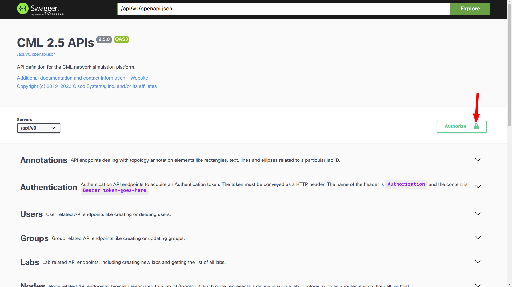

Experiment with various API calls like:

- acquire an authentication token
- list all labs
- list nodes of a lab
- start or stop a lab
- check system health
- list known node definitions

This concludes the API via Swagger section.

### Use of the Python Client Library (PCL)

The PCL is available for download from the controller or on PyPI (Python package index). On the dCloud demo instance, the package is already installed. For the following sections we need a Terminal / CLI access. On the Windows machine, click Start, then type "command" (for "Command prompt") and **run it as administrator**:


The *administrator* bit is important to make some commands work later on. Note that this will start the shell in the Windows system directory. Change the working directory to the Administrator's home directory using:

```
cd C:\Users\Administrator
```

We'll check now via `pip list` what Python packages are already installed. In this case, the virl2-client (Python Client Library / PCL) is already there but it is outdated (see the output below). We're going to upgrade it to the latest version via `pip install --upgrade virl2-client`:


If the PCL is not installed, then a simple `pip install virl2-client` will do. 

The documentation for the PCL is built into the CML controller and can be opened by navigating to Tools ➡ Client Library which opens a new tab:

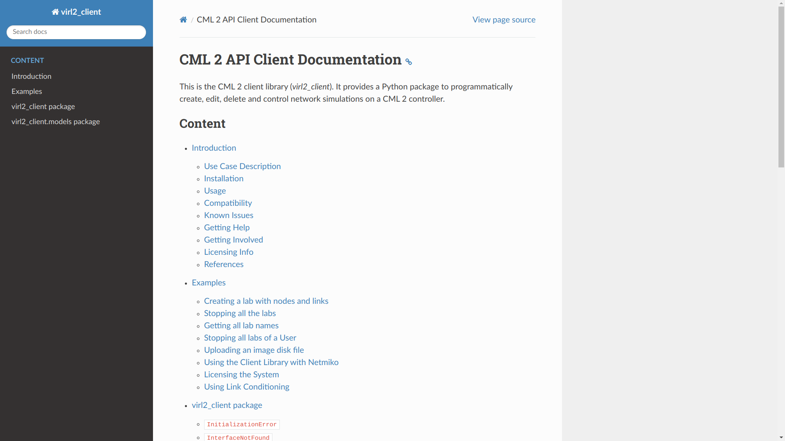

The documentation has a couple of examples to work through:

- create a lab with nodes and links
- stopping all labs
- getting all lab names

You can copy and paste these examples into a file (via Notepad, for example) and run them via the command line like this:

```plain
python demo1.py
```

This example assumes you've copied the code example into a file called `demo1.py`.

This concludes the PCL section.

### virl-utils: taking the PCL to the next level

virl-utils is a tool written in Python and available on GitHub and PyPI. It is modeled after the "vagrant up" tool from Hashicorp and uses the PCL extensively. In fact, since it's available on GitHub, you can study it as a good example how to use the PCL.

virl-utils can be easily installed via pip. At the command prompt run `pip install virlutils` (note there's no dash!), it might pull in a couple of dependencies:

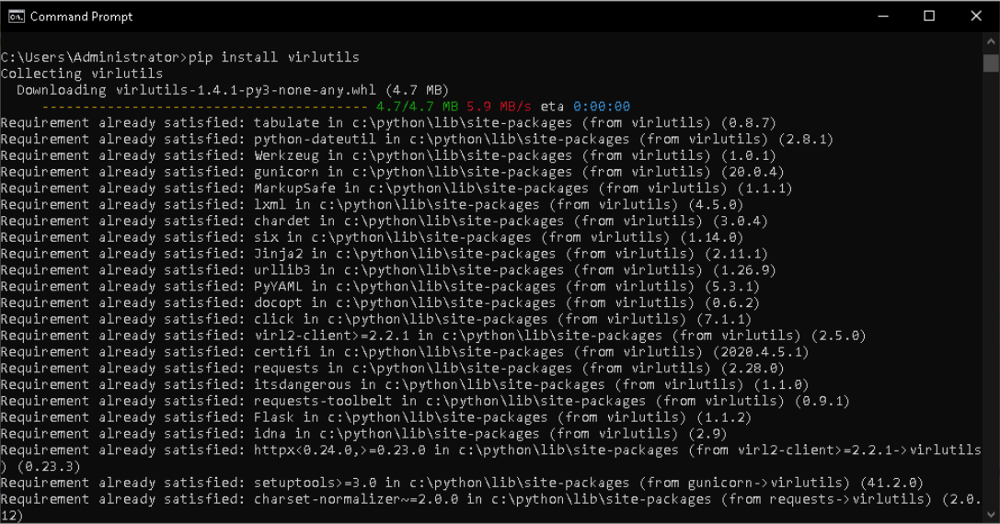

After the installation has succeeded, the `virl` command is available:

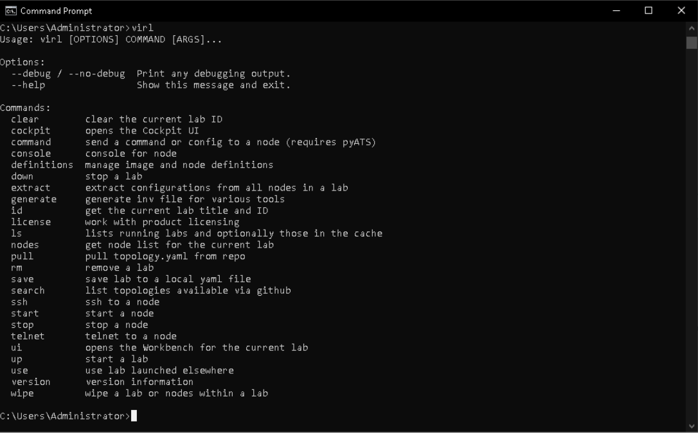

After installation, the tool must be configured, the documentation is [available here](https://github.com/CiscoDevNet/virlutils#configuration). For this demo, we simply copy and change the user name from `demo` to `admin` in the `.virlrc` file that was already there. With a command prompt open in the Administrator's home directory `C:\Users\Administrator`, the file can be edited by running `notepad .virlrc`:


Don't forget to save the file!

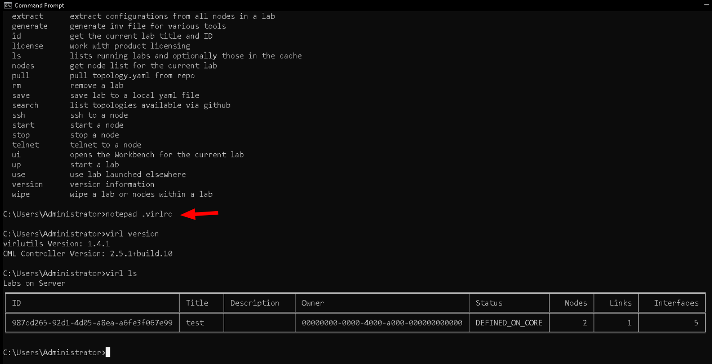

After the tool is configured OK, we can use the various sub commands of the `virl` command like

- list labs via `ls`
- open consoles into nodes
- start / stop / wipe / remove a lab

The tool uses the concept of a "current lab". The current lab is automatically set when starting it via `virl up`. You might have started a lab already using the UI or via previous exercises. In this case you can do

``` To connect to a console, we must first "use" a lab
$ virl use -n test
```

Assuming your lab is called test (as in the screen shot above). From here, you can now work with the nodes in the lab:


This concludes the virl-utils section.

### Breakout tool

The breakout tool allows to use native tools like PuTTY or VNC clients to connect to node consoles or graphical user interfaces.

It is available on the controller to download for Windows, Linux and macOS (Apple Silicon and Intel variants available).

The breakout tool is already installed on the dCloud Windows machine, but it's not the current version. We can download the current version from the controller by navigating to *Tools* ➡ *Breakout Tool*. Then download the Windows version:


Copy the file into the current directory, renaming it to `breakout.exe`:

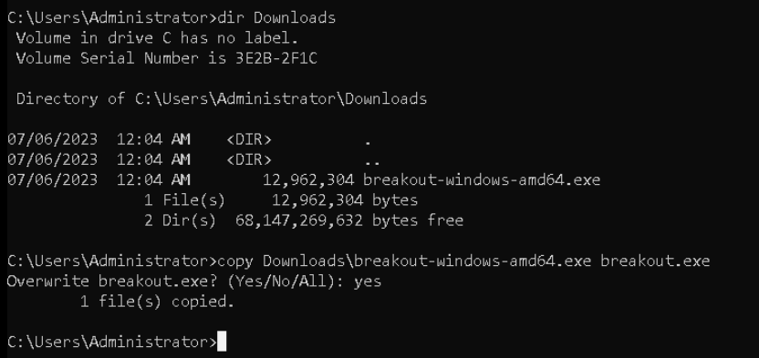

Next, we need to verify the configuration. If nothing has been pre-configured then the steps are:

- run "config" -- `breakout config` to create a template configuration file

- edit the configuration file to match your controller address, username and password using `notepad config.yaml`, don't forget to save the file. The controller address is `https://cml.demo.dcloud.cisco.com`. **Ensure that there is no trailing slash!** Change the listen address to `localhost`. It should look like this:
  ``` 
  console_start_port: 9000
  controller: https://cml.demo.dcloud.cisco.com
  extra_lf: false
  lab_config_name: labs.yaml
  listen_address: localhost
  password: C1sco12345
  populate_all: false
  ui_server_port: 8080
  username: admin
  verify_tls: false
  vnc_start_port: 5900
  ```

- start a lab (in case none is running at the moment). To use VNC, have at least one Desktop node running in a lab

- run "init" -- `breakout init` to download information about running labs from the controller

- edit the created `labs.yaml` file and set the `enabled` flag to `true` for the labs you want to use. Note that if multiple labs are enabled, you need to ensure that there's no conflict in the ports being used.
  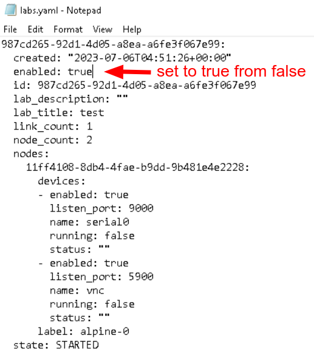

- run "run" -- `breakout run` to actually run the tool and make the ports available
  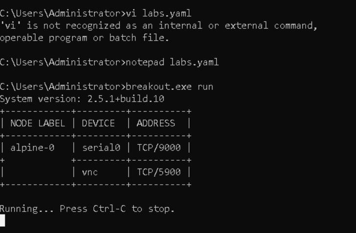

- use your native clients to connect to the ports displayed
  

Alternatively, most of these steps can also be done via the convenient "breakout UI" which is available when running `breakout ui`. When running the UI, point your browser to the address displayed in the command prompt:

```
Running... Serving UI/API on http://localhost:8080, Ctrl-C to stop.
```

The "listening address" and port (here localhost and 8080) can be changed in the `config.yaml` or in the UI itself. Note, that changes to those parameters require a restart of the tool.

This concludes the breakout section.

### Terminal Server

The built-in terminal server of CML allows secure and authenticated access to otherwise non-authenticated and plain text consoles of virtual network devices.

CML uses SSH on the standard SSH port TCP/22 to provide either a menu or, for advanced use cases, direct access to individual consoles of devices. The CML terminal server replaces the standard SSH server of the underlying OS. The OS SSH server is disabled by default. When enabled via Cockpit (as shown in one of the previous sections) the OS SSH server listens on TCP/1122.

Use the PuTTY client on Windows and point it to the CML controller:


Enter the hostname (cml-controller works here) and leave SSH selected for the connection type. Click "Open" (you might get a warning with the fingerprints of the host to confirm).

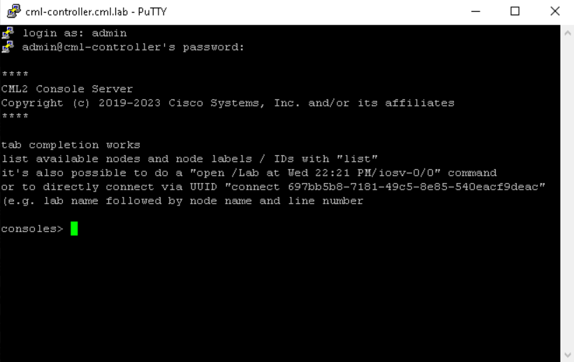

Enter user name (`admin`) and password (`C1sco12345`) and you will be greeted by the terminal server prompt. From here, you can list labs and open consoles. Note that you can also press tab to complete names. Start with typing `help`.


#### Advanced usage

The terminal server also allows direct access to device consoles, omitting the menu. You can directly pass the "command" to the SSH client.


The important piece here is to pass the "-t" flag to the SSH client. This requests a TTY for the session and is mandatory to get an interactive prompt. Note that the `open /test/alpine-0/0` is identical to the command that is executed in interactive mode above.

The same procedure is also possible wit e.g. PutTTY but it's easier and conciser to demonstrate with the OpenSSH command line client.

This concludes the terminal server section.

## Appendix

### Additional tools and links

- Ansible plug-in to automate labs is available in Ansible galaxy or [here](https://github.com/CiscoDevNet/ansible-virl).
- Terraform provider available on [Hashicorp's registry](https://registry.terraform.io/providers/CiscoDevNet/cml2/latest/docs) or [here](https://github.com/CiscoDevNet/terraform-provider-cml2)
- PyATS for automated device testing [here](https://developer.cisco.com/pyats/)
- CML Community repository with additional node definitions and utilities [here](https://github.com/CiscoDevNet/cml-community)

### Other custom images

#### Windows 10

Microsoft used to provide Edge Developer VMs based on Windows 10. These have been, however, removed. There's still eval VMs for Windows 11 available but CML currently lacks TPM support... and, beware, these images are quite big.

#### Virtual WLC

As an alternative, you can also install the virtual Wireless LAN Controller from [CCO here](https://software.cisco.com/download/home/284464214/type/280926587), choose the OVA ~620MB, "Cisco Wireless LAN Small Scale Virtual Controller Installation with 60 day evaluation license". The process is slightly different as we need to "pre-install" the operating system.

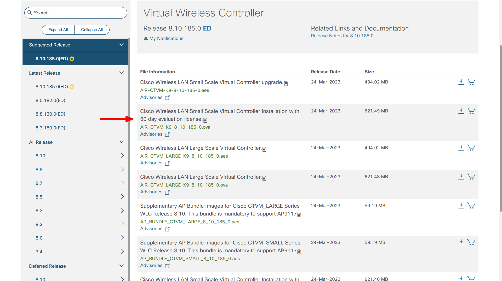


##### vWLC Image Building

The vWLC building process is slightly different as the disk image finally deployed on CML must be created and the OS installed on it first. This is a common scenario where install media is provided which needs to be installed on a disk. For this reason, the steps here include the creation of a stand-alone VM using Qemu/KVM and, as a result of this process, obtain a disk file which then can be used inside of CML.

>  **Note** this might or might not work depending on the OS and what the installation process creates on the target disk. There's typically some "cleanup" required at the end of such an installation to allow the "cloning" of machines created from such a disk image.
>
> It sometimes might be a good idea to install the desired OS inside of VMware Workstation or VirtualBox and, when done, convert the resulting disk into QCOW2 format.

These steps are for reference and can be done on the CML controller itself.  Or on any Linux host that has the Qemu packages installed.

When using the `-curses` parameter the console of the VM will be in the terminal... However, to kill/end the VM you need to get into another terminal and kill the process.  Without `-curses` and with a UI (like on the Mac or on a Linux with UI / Desktop) one can simply close the Qemu window.

```
$ mkdir build
$ cd build
$ tar xvf ../AIR*.ova
x AS_CTVM_SMALL_8_10_151_0.ovf
x AS_CTVM_SMALL_8_10_151_0.mf
x AS_CTVM_SMALL_8_10_151_0.vmdk
x AS_CTVM_SMALL_8_10_151_0.iso
x VmMgmtNetwork.xml
x VmSpNetwork.xml
$ qemu-img convert -pc -Oqcow2 AS_CTVM_SMALL_8_10_151_0.vmdk AS_CTVM_SMALL_8_10_151_0.qcow2
    (100.00/100%)
$ qemu-system-x86_64 -curses -accel hvf -m 2048 -cdrom AS_CTVM_SMALL_8_10_151_0.iso -hda AS_CTVM_SMALL_8_10_151_0.qcow2
qemu-system-x86_64: warning: host doesn't support requested feature: CPUID.80000001H:ECX.svm [bit 2]
$ ls -lh
total 4130984
-rw-r--r--@ 1 rschmied  staff   618M Mar  4 10:57 AS_CTVM_SMALL_8_10_151_0.iso
-rw-r--r--@ 1 rschmied  staff   366B Mar  4 10:57 AS_CTVM_SMALL_8_10_151_0.mf
-rw-r--r--@ 1 rschmied  staff   6.4K Mar  4 10:57 AS_CTVM_SMALL_8_10_151_0.ovf
-rw-r--r--  1 rschmied  staff   1.4G Jul 14 17:32 AS_CTVM_SMALL_8_10_151_0.qcow2
-rw-r--r--@ 1 rschmied  staff    72K Mar  4 10:57 AS_CTVM_SMALL_8_10_151_0.vmdk
-rw-r--r--@ 1 rschmied  staff   1.3K Mar  4 10:57 VmMgmtNetwork.xml
-rw-r--r--@ 1 rschmied  staff   1.0K Mar  4 10:57 VmSpNetwork.xml
$ qemu-img convert -pc -Oqcow2 AS_CTVM_SMALL_8_10_151_0.qcow2 vwlc-disk.qcow2
    (100.00/100%)
$ rm AS* Vm*.xml
$ ls -lh
total 2234368
-rw-r--r--  1 rschmied  staff   1.1G Jul 14 17:34 vwlc-disk.qcow2
$
```

This can be used to test the image.  It will create a linked clone of the disk named `test-disk.qcow2` and start a VM... You should see output on the screen...  You can also `telnet 127.0.0.1 4444` to get access to the serial console.  Same caveat regarding closing the VM applies (see above).

```
$ qemu-img create -b vwlc-disk.qcow2 -fqcow2 test-disk.qcow2
$ qemu-system-x86_64 -curses -accel hvf -m 2048 -hda test-disk.qcow2 -serial telnet:127.0.0.1:4444,server,nowait -device e1000
```

### Running  your own instance

#### Hardware

You need a computer to run CML on.  A somewhat recent laptop should be sufficient to get you up-and-running.  As laptop are somewhat limited in available resources, but they should be sufficient to learn the basics and to get a better understanding how to install and run CML on larger computers

- **Memory:** At least 16GB of memory, 8 or 10GB should be dedicated to the CML Virtual Machine
- **CPU:** the more, the merrier… 4 vCPUs / threads should be assigned to the CML Virtual Machine
- **Disk Space:** At least 8GB of free disk space required, more is better especially if you want to install additional images like Windows 10… For Windows 10, you should set at least 16GB of free space aside.

Recommendation:  Use a USB 3.0 portable hard drive to store the images and install the software on.

#### License

To run the software, you also need a license.  Personal or Personal plus licenses can be bought via the [Cisco Learning Network Store](https://learningnetworkstore.cisco.com/cisco-modeling-labs-personal).

#### Software

##### VMware Workstation

CML comes as an OVA to be deployed on VMware products.  To run CML, you need to have a hypervisor installed. On Windows and Linux, VMware Workstation can be used. Unfortunately, running CML on Apple hardware is only possible with Intel architecture,  Apple Silicon models can't run CML!  Alternatively, you can run on VMware ESXi 6.7 or later as well if you have access to such infrastructure.

You should also be OK to use a trial license for Workstation or use VMware Player, if available on your platform.

##### Cisco Modeling Labs Software

Software can be downloaded from CCO. You need two images, the OVA and the ISO. Bare metal installs (as an alternative to install as a virtual machine) require the ISO instead of the OVA.

https://software.cisco.com/download/home/286193282/type/286326381

Download the OVA and the reference platform ISO file (here, the 2.5.1 version is shown):

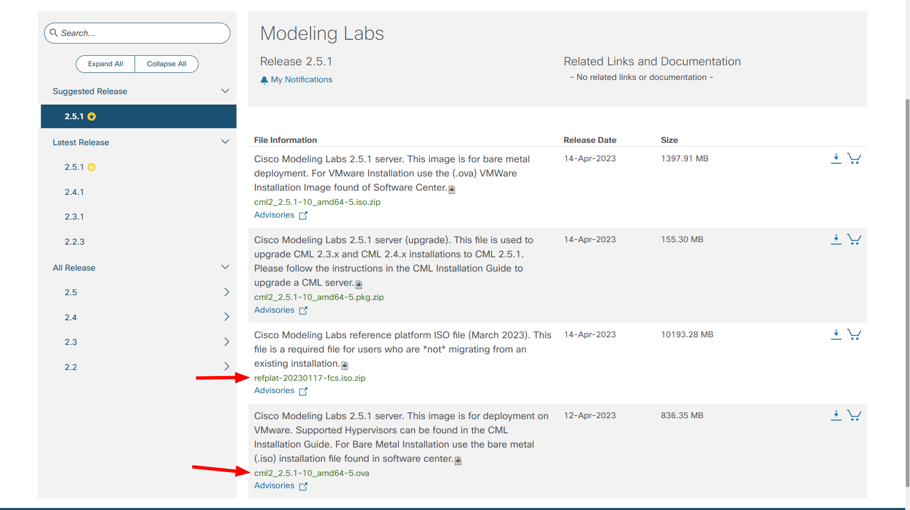

